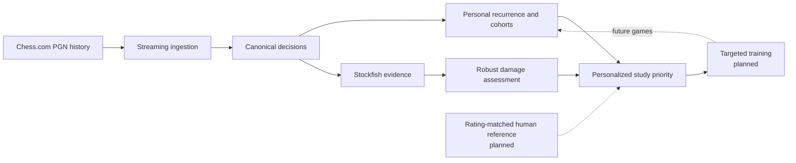

# Chess Decision Explorer

**Personalized chess improvement from the decisions a player actually repeats.**

Most chess analysis reviews games one at a time. Chess Decision Explorer asks a longer-term question:

> Which decisions keep returning in a player's games, which choices are meaningfully damaging, and what should the player study first?

The long-term product is designed to combine three evidence sources:

- **Personal history** — what positions the player reaches and which moves they repeatedly choose.
- **Engine evidence** — whether a move is materially worse than credible alternatives under controlled Stockfish analysis.
- **Rating-matched human evidence** — how comparable players choose and continue from the same or related positions.

Those signals are intended to become targeted training and, later, a way to measure whether a recurring weakness improves in future games.

The current repository implements the personal-history pipeline and the Stockfish-based damage-assessment foundation. Human-reference analysis and the training product are roadmap items, not completed features.

## What works today

The current GitHub checkpoint includes:

- streaming PGN ingestion into source-neutral game records;
- canonical chess-position and move identities for recurring-decision analysis;
- dictionary-backed aggregation of recurrence, distinct-game counts, choices, and outcomes;
- separate Rapid, Blitz, and Bullet personal cohorts;
- Stockfish 19 integration through UCI with node-budgeted unrestricted and forced-move searches;
- robust move-damage assessment that confirms a fixed alternative across increasing search budgets instead of treating every deviation from Stockfish's first line as a mistake;
- a two-level evaluation cache: in-memory L1 plus persistent SQLite L2;
- semantic cache identity tied to the position, search contract, engine binary identity, and analysis configuration;
- extensive unit, regression, adversarial, and opt-in real-Stockfish integration tests.

The pipeline has also been exercised on **thousands of real Chess.com games**. Personal PGNs are intentionally excluded from the repository.

## System at a glance



The important separation is deliberate: personal recurrence, engine evidence, and future human-reference evidence are different kinds of information. They are not collapsed into one arbitrary weighted score.

## Core analytical model

The project starts from a small immutable domain model:

```text
PositionKey  = canonical position before the move
MoveKey      = move played, stored in UCI
DecisionKey  = (PositionKey, MoveKey)
```

`PositionKey` uses the chess state needed for recurring-position identity:

- piece placement;
- side to move;
- castling rights;
- legally relevant en-passant state.

Move counters and prior repetition history are intentionally excluded from recurring-position identity. Exact historical draw context is a separate problem and is not silently mixed into canonical analysis.

This representation lets the same decision be recognized across different PGN files without tying the analytical identity to player names, dates, move numbers, ratings, or source metadata.

## Engineering highlights

### Streaming ingestion and memory-conscious aggregation

PGNs are parsed one game at a time. Player decisions are normalized before aggregation, and the central `PositionIndex` keeps compact statistics rather than permanent sets of every contributing game ID.

This keeps ingestion and aggregation independent of the eventual UI or data source and provides a bounded-memory foundation for larger corpora.

### Hash-based position indexing

Canonical `PositionKey` and `DecisionKey` value objects are used as dictionary keys for recurrence and move statistics. The aggregation layer distinguishes:

- total occurrences;
- distinct games containing a position or decision;
- player choices;
- actor-relative outcomes.

This separation matters because a position can legitimately recur more than once inside the same game.

### Stockfish as an external evidence source

Stockfish is run through the UCI protocol using `python-chess`. Engine analysis is normalized to the side to move at the canonical root and supports both:

- unrestricted candidate discovery;
- forced-root evaluation of a specific move.

The project keeps raw centipawn/mate evidence alongside Stockfish WDL and derives an **engine-model expected score** for comparisons. It is not presented as a human win probability.

### Damage assessment, not “top move” matching

The current assessment layer is intentionally conservative. A player's move is not considered damaging simply because Stockfish prefers another move.

A credible alternative must remain materially better under prescribed higher-budget confirmation, with consistency checks for search drift, sign reversals, mate-direction conflicts, and incompatible evidence.

The result is a bounded evidence procedure designed to reduce false weakness labels caused by finite-search noise.

### Two-level semantic cache

Engine analysis is expensive and highly reusable, so evaluations are cached in two tiers:

```text
request
  -> in-memory cache (L1)
  -> SQLite cache (L2)
  -> Stockfish only on a miss
```

Persistent cache identity includes the canonical position, search mode, requested budget, analysis profile, evidence-contract version, and SHA-256 identity of the Stockfish executable.

The cache is treated as disposable computed evidence rather than product/user state. Corrupt or semantically incompatible cached evidence fails loudly instead of being silently reused.

## Real-data validation

The personal-data pipeline has been exercised on a local Chess.com history containing **5,128 completed games** across 60 monthly PGN files.

That dataset is useful as real input and edge-case coverage; it is not presented as a large public corpus. Raw personal data is excluded from Git by design.

The larger human-reference layer is planned separately so personal evidence and population evidence remain logically independent.

## Current status

| Phase | Status |
| --- | --- |
| Domain model and recurring-position identity | Complete |
| Position / decision aggregation | Complete |
| Streaming PGN ingestion | Complete |
| Personal Rapid / Blitz / Bullet cohorts | Complete |
| Stockfish UCI evaluation foundation | Complete |
| In-memory + SQLite semantic evaluation cache | Complete |
| Robust engine damage assessment | Complete on current `main` |
| Personalized recurrence × damage prioritization | Active Step 4C |
| Rating-matched human reference corpus | Planned |
| Opening / repertoire context | Planned |
| Training workflow and later-game progress tracking | Planned |

The detailed architecture contracts and current engineering state live in [`docs/architecture.md`](docs/architecture.md) and [`docs/project_state.md`](docs/project_state.md).

## Roadmap

The next product layers are intentionally incremental:

1. **Personalized priority** — combine admitted engine-damage evidence with the player's own recurrence so the system can answer “what should I study first?”
2. **Occurrence traceability and deduplication** — preserve source-game references without bloating the aggregate index.
3. **Opening and repertoire context** — organize recurring weaknesses by the lines the player actually reaches.
4. **Human-reference characterization** — process an initial rating-matched public corpus to learn where exact-position evidence is statistically useful.
5. **Large compressed reference data** — stream `.pgn.zst` data through bounded-memory aggregation rather than fully decompressing the corpus to disk or memory.
6. **Targeted training** — convert high-priority weaknesses into short, verified exercises.
7. **Longitudinal follow-up** — observe future opportunities and distinguish real improvement from simply no longer reaching a position.

A later research direction is broader **pattern intelligence**: identifying repeated strategic or tactical mistakes across different exact positions. That work will require validated chess features or similarity methods and is intentionally separate from the exact-position foundation.

## Repository structure

```text
src/chess_decision_explorer/
  domain.py          immutable chess-domain value objects
  aggregation.py     recurrence and outcome aggregation
  ingestion.py       streaming PGN parsing and decision extraction
  personal.py        personal cohort classification and indexing
  engine.py          Stockfish/UCI evaluation boundary
  engine_cache.py    in-memory + SQLite semantic cache
  assessment.py      robust move-damage assessment

docs/
  architecture.md    durable architecture decisions
  project_state.md   implementation and verification state
scripts/
  stockfish_smoke.py             real-engine cache/evaluation smoke test
  stockfish_assessment_smoke.py  real-engine damage-assessment smoke test
```

## Running locally

Requirements:

- Python 3.10+
- a local Stockfish executable for real-engine analysis

Create a virtual environment and install the project:

```bash
python3 -m venv .venv
source .venv/bin/activate
python -m pip install -e ".[dev]"
```

Run the ordinary test suite:

```bash
pytest
```

The standard tests do not require a real Stockfish binary.

Run the Step 4A engine/cache smoke test against a local executable:

```bash
python scripts/stockfish_smoke.py /path/to/stockfish
```

Run the opt-in Step 4B real-engine integration tests:

```bash
CDE_STOCKFISH_PATH=/path/to/stockfish \
pytest tests/test_assessment_stockfish.py
```

## Design principles

A few principles guide the project as it grows:

- **Evidence stays attributable.** Personal history, engine analysis, human-reference data, and future training evidence answer different questions.
- **Expensive computation should be reusable.** Cache identity follows semantics, not filenames or machine paths.
- **Ambiguous engine evidence may abstain.** Precision is preferred over confidently labeling search noise as a weakness.
- **Raw data and derived data have different lifecycles.** Personal PGNs and future public corpora remain source data; engine caches and analytical aggregates are derived artifacts.
- **Scale follows product need.** Streaming, compression, cloud infrastructure, and ML are introduced when a real analytical or product requirement justifies them.

## Scope

Chess Decision Explorer is currently an **analysis-core project**, not a finished end-user application. The repository focuses on correctness, reproducibility, and the analytical foundation required before a training UI is built.

That distinction is intentional: the goal is to make the eventual recommendation “study this decision next” explainable from the underlying evidence rather than layering a UI over weak analytics.
