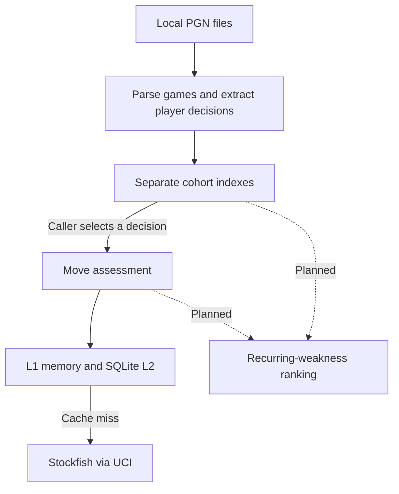

# Chess Decision Explorer

A Python analysis core for a personalized chess-improvement system: find decisions a player repeats, assess the engine evidence, and eventually turn recurring weaknesses into targeted practice.

The unit of analysis is a **decision: the position before a move, paired with the move played**. This connects the same choice across games, including positions reached through different move orders.

**Implemented:** streaming local PGN ingestion, recurring-position statistics, separate Rapid / Blitz / Bullet cohorts, Stockfish evaluation through UCI, an in-memory / SQLite evaluation cache, and a multi-stage move-assessment procedure.

**Current boundary:** move assessment still needs calibration and review. A streaming comparison against external human games is implemented but has not been run at scale, so no human-reference evidence exists yet. Recurrence-based weakness ranking, rating-matched human cohorts, and training are future work. The repository currently exposes Python APIs, a human-reference CLI, and engine smoke scripts.

## Data flow



Personal statistics describe what happened. Engine assessments evaluate a canonical decision. The future ranking layer will combine recurrence with accepted damage evidence; rating-matched human data will remain a separate source of evidence.

## Design decisions

### Recognize positions without tying them to a game

`DecisionKey = (PositionKey, MoveKey)` uses immutable value objects. `MoveKey` stores UCI notation, such as `e2e4`. `PositionKey` includes piece placement, side to move, castling rights, and only legally relevant en-passant state.

Move counters and prior repetition history are excluded. Engine analysis reconstructs this canonical position with reset counters and no pre-root history. That supports reuse across games, but an assessment does not reconstruct the exact draw-rule context of every historical occurrence.

### Count recurrence without counting a game's result twice

PGNs are read one game at a time. A dictionary maps each `PositionKey` to position statistics, with move statistics keyed by `MoveKey` inside it.

If a player reaches the same position three times in one game, that contributes three occurrences but one distinct game and one game outcome. Choice frequency uses occurrences; outcome statistics use distinct games. Eligible personal games are indexed separately by Rapid, Blitz, and Bullet.

The index validates a game's observations before updating statistics and discards temporary per-game bookkeeping afterward. It retains no permanent game-ID sets. Memory still grows with unique indexed positions and decisions; the L1 evaluation cache also has no eviction policy. Preventing duplicate game submissions across ingestion calls remains the caller's responsibility.

### Compare moves under controlled engine searches

An unrestricted search discovers an alternative. The observed move and that alternative are then evaluated in separate forced-root searches at equal requested node budgets. Only those forced evaluations enter the comparison.

For a positive assessment, the **same alternative** must remain meaningfully better across two prescribed search levels. The procedure checks changes in the gap and both component evaluations, sign reversals, and mate-direction conflicts. It allows one optional higher-budget escalation, then stops; unresolved evidence can produce `INCONCLUSIVE`.

Engine output is validated before use: scores must be unbounded UCI reports, WDL must be complete, and the principal variation must replay legally and match the requested root move. Centipawn and mate evidence are retained alongside WDL. Comparisons use engine-model expected score from the root player's perspective, which is distinct from a human win probability.

**Calibration is pending.** No production thresholds, search budgets, or measured error rates are established. A policy marked `UNCALIBRATED` cannot emit `DAMAGE_SUPPORTED`; the real-engine examples use explicitly labeled demonstration policies. `NO_DAMAGE_DEMONSTRATED` means the procedure found no qualifying evidence, without proving the move optimal.

### Cache engine evidence independently of assessment policy

Requests check an in-memory L1 cache, then persistent SQLite L2, and run Stockfish only on a miss. Both tiers use the same semantic key: canonical position, search mode and forced move, requested budget, engine executable SHA-256, engine configuration, and versioned analysis and evidence contracts.

SQLite rows are revalidated against their requests. Unsupported schemas, corrupt evidence, and conflicting writes raise errors; existing evidence is never silently overwritten. Persistence succeeds before L1 is updated.

Assessment thresholds are outside the primitive evaluation key. Changing a comparison threshold can reuse identical Stockfish evidence while deriving a new assessment. The supported engine configuration uses the default network; caller-selected external NNUE files are outside the current cache contract.

## Run locally

Use Python 3.10+; development is on Ubuntu/Linux. From the repository root:

```bash
python3 -m venv .venv
source .venv/bin/activate
python -m pip install -e ".[dev]"
```

### Build personal recurrence statistics

This example reads a local PGN containing the selected player's completed standard-chess games. Replace the path and username with your own:

```python
from chess_decision_explorer.ingestion import iter_pgn_records
from chess_decision_explorer.personal import (
    PersonalAnalysisPolicy,
    build_personal_analysis,
)

with open("data/personal/games.pgn", encoding="utf-8") as handle:
    result = build_personal_analysis(
        iter_pgn_records(handle, source_id="personal-history"),
        player_name="YOUR_USERNAME",
        policy=PersonalAnalysisPolicy(),
    )

print("Games indexed:", result.totals.total_indexed)
print("Unique Rapid positions:", len(result.rapid.index))
for position, stats in result.rapid.index.items():
    if stats.distinct_game_count >= 2:
        print(position, "games:", stats.distinct_game_count)
```

The default cohort policy uses the player's own rating: Rapid ≥ 800, Blitz ≥ 501, and Bullet ≥ 600. Games below those thresholds, with missing ratings, or with unknown time controls are counted separately and excluded from the indexes. This example produces recurrence statistics; weakness ranking is planned.

### Tests and engine checks

```bash
python -m pytest
```

The ordinary suite uses synthetic games and controlled engine evidence to check recurrence accounting, evidence validation, search instability, and cache integrity. Real-engine tests are skipped unless `CDE_STOCKFISH_PATH` is set.

For engine checks, supply a local Stockfish executable with `UCI_ShowWDL` support and its default network. Stockfish is a separate dependency; it is not installed by pip.

```bash
python scripts/stockfish_smoke.py /path/to/stockfish
python scripts/stockfish_assessment_smoke.py /path/to/stockfish
CDE_STOCKFISH_PATH=/path/to/stockfish python -m pytest tests/test_assessment_stockfish.py
```

The documented local checks used Stockfish 19 and exercised both player perspectives, forced-move evaluation, cache reuse, and SQLite reopening. The personal pipeline has also been exercised on thousands of real Chess.com games; the [verification notes](docs/project_state.md) record that run. Raw personal PGNs are excluded from Git. These checks establish exercised behavior, while damage-label reliability still requires calibration.

## Repository guide

| Path | Responsibility |
| --- | --- |
| `src/chess_decision_explorer/domain.py` | Position, move, decision, and outcome identities |
| `src/chess_decision_explorer/ingestion.py` | Streaming local PGN parsing and player-decision extraction |
| `src/chess_decision_explorer/aggregation.py` | Occurrence, distinct-game, choice, and outcome statistics |
| `src/chess_decision_explorer/personal.py` | Personal eligibility policy and separate time-control cohorts |
| `src/chess_decision_explorer/engine.py` | UCI lifecycle, canonical requests, and engine-evidence validation |
| `src/chess_decision_explorer/engine_cache.py` | Shared cache identity and L1 / SQLite persistence |
| `src/chess_decision_explorer/assessment.py` | Move comparisons, confirmation, and assessment provenance |
| `scripts/` and `tests/` | Manual engine checks and automated behavioral tests |

See [architecture decisions](docs/architecture.md) for contracts and tradeoffs, and [project state](docs/project_state.md) for implementation and verification notes.

## Next steps

- Review and calibrate move assessment on real data, including false positives, abstentions, and computational cost.
- Rank recurring decisions using personal recurrence and admitted engine damage, with source traceability and ingestion deduplication.
- Add rating-matched human-reference data and opening / repertoire context as separate analytical layers.
- Generate targeted practice and track performance when those decisions recur in later games.

Chess.com API ingestion, a public Lichess corpus pipeline, opening classification, and a training UI are not implemented. Broader pattern analysis across different positions remains a later research direction.
